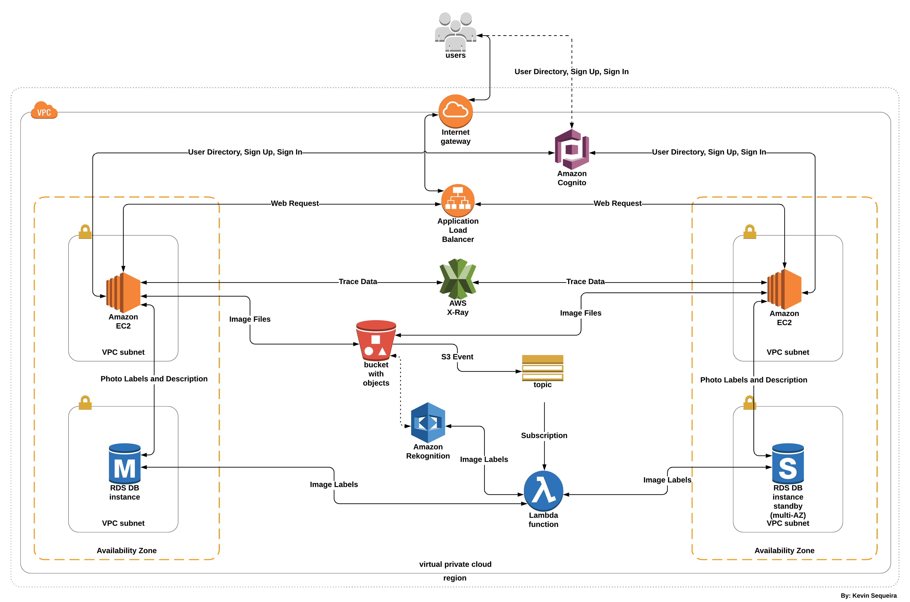

# AWS-Python-Flask

Version 1.0  

Architected a highly available and fault tolerant python application.

## Getting Started

The user is signs in/signs up on the home screen. The user is then authenticated against the user data pool in Amazon cognito. Once authenticated the user can upload images. Once the image is uploaded it is saved in Amazon S3. Every time an image is uploaded an S3 event is triggered and the Lambda function that is subscribed to the AWS SNS topic gets invoked. This function tells Amazon Rekognition to process the labels for the uploaded image in Amazon S3. The lambda function then takes these labels and saves it in a relational database. We also collect trace data using AWS X-Ray from the EC2 instance on which the application is deployed to see the performance of our application.

## Architecture

This is an image of the architecture of the application and different AWS services it uses.

## Built and Deployed with:

* Amazon EC2
* Amazon Cognito
* Amazon Rekognition
* Amazon Relational Database
* Amazon S3
* Amazon SNS
* AWS X-Ray
* AWS Lambda
* Code from GitHub: Python, HTML, CSS, JavaScript

